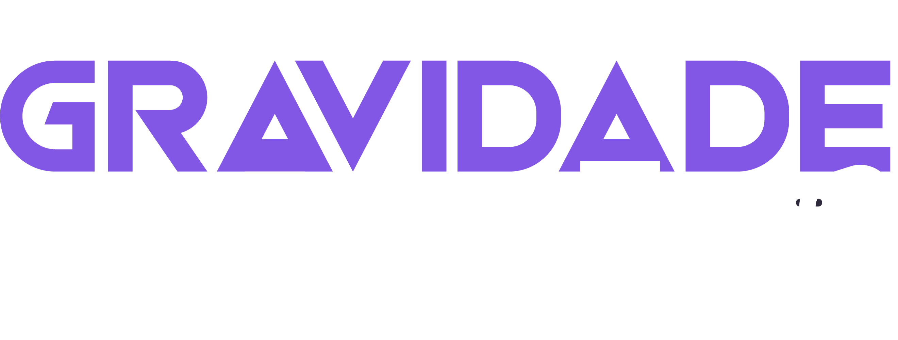

<h1 align="center">
    
    <br>
</h1>

<h2 align="center">
  <a href="https://github.com/DicoMonteiro/getgeeks-gzero/tree/master/tests">Robot Framework</a> + <a href="https://github.com/DicoMonteiro/getgeeks-gzero/tree/master/resources/factories">Python</a>
</h2>

<h4 align="center">
  It's an app for waste collection created during <a href="https://gravidadezero.qaninja.academy">Gravidade Zero</a>
  <br>
  Created with :purple_heart:  by <a href="https://qaninja.academy/">QANinja</a>
</h4>

## :video_camera: Demonstration

#### Automation Front-end

## Final Challenge - Módulo PRO
<h2 align="center">
  
</h2>

## :rocket: Technologies

#### Automation Front-end

-  [Python](https://www.python.org/)
-  [Robot Framework](https://robotframework.org/)
-  [Lib Browser](https://github.com/MarketSquare/robotframework-browser)
  
#### Automation Back-end

-  [Python](https://www.python.org/)
-  [Robot Framework](https://robotframework.org/)
-  [Lib Request](https://github.com/MarketSquare/robotframework-requests#readme)

## :information_source: How To Prepare

To clone and run this application, you'll need [Git](https://git-scm.com). Follow the instructions:

### Pré-conditions ###

```bash
[x] - Install Python 3.7 or over
[x] - Install Node.js 14.15 or over
[x] - Install Git
[x] - Clone this repository: git clone https://github.com/DicoMonteiro/getgeeks-gzero
[x] - Install the libraries of project: pip install -r requirements.txt
```

## :information_source: How To Execute

```bash
    [x] For linux ou mac:

        ./run.sh

    [x] For Windows:

        ./run.bat

```

## :information_source: More About The Challenge 

Desafio implementado conforme as especifições solicitadas e documentadas no arquivo: [/docs/geek.md](docs/geek.md)

## :memo: License
This project is under the MIT license. See the [LICENSE](https://github.com/DicoMonteiro/getgeeks-gzero/LICENSE) for more information.

---

Made with :purple_heart:  by Adriano Almeida :wave:  [Get in touch!](https://www.linkedin.com/in/adriano-barreto-monteiro-almeida/)

[vc]: https://code.visualstudio.com/
